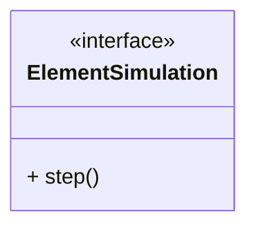
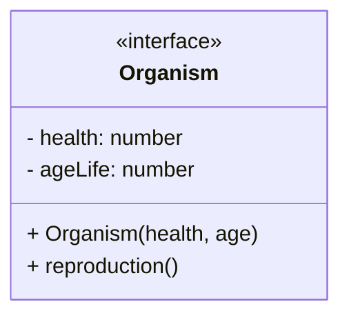
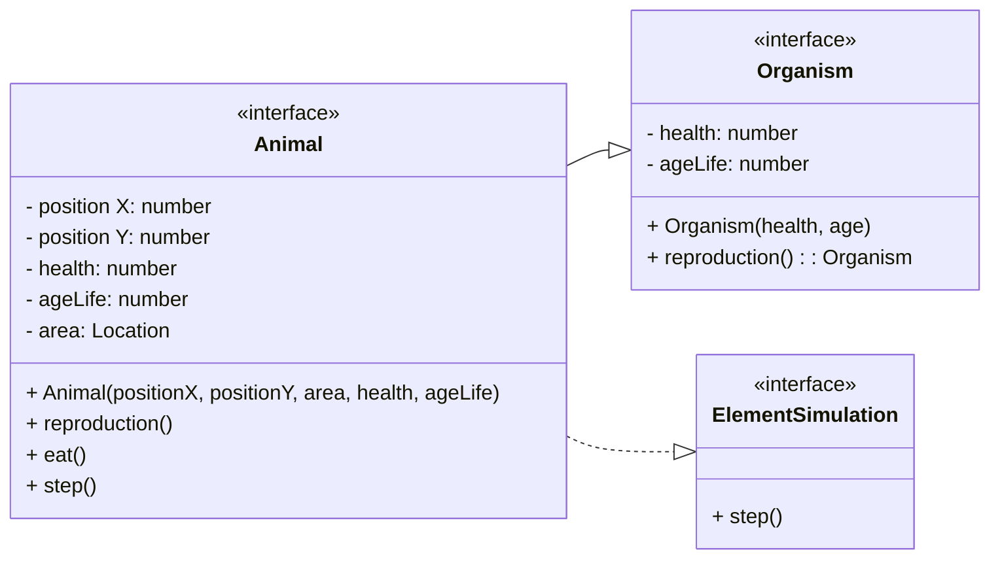
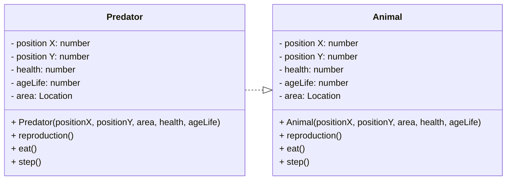
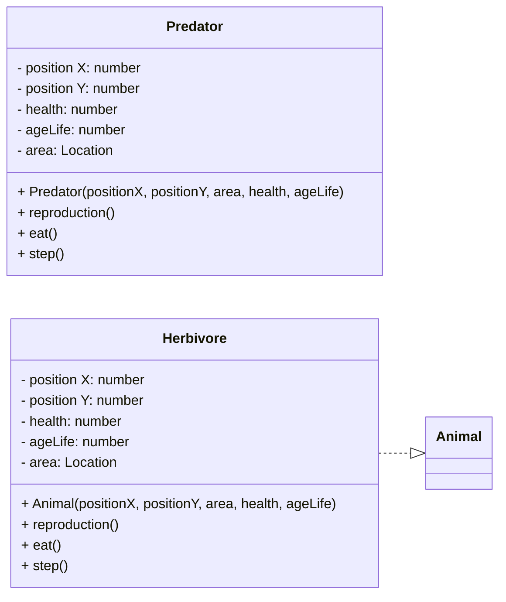

Лабораторная работа №1
===========

### **Тема**: Модель животного мира<br>

### **Предметная область**: взаимодействие жителей леса в формате игровой симуляции<br>
### **Важные сущности**:<br>
**Элемент симуляции** - интерфейс, который будет имплементирован в каждой сущности нашей симуляции.<br>


  
<h4>Живой организм<br>


  
Растения<br>
```mermaid
classDiagram
  direction LR
  
  class Organism {
  <<interface>>
    - health: number
    - ageLife: number
    + Organism(health, age)
    + reproduction()
  }
  
  class ElementSimulation {
  <<interface>>
    + step()
  }
  
  class Plant {
    - health: number
    - ageLife: number
    + Plant()
    + step()
    + reproduction()
  }
  
    
   Plant --|> Organism
   Plant ..|> ElementSimulation
 ```

 <h4>Локация<br>

```mermaid
classDiagram
  direction LR
  class ElementSimulation {
  <<interface>>
    + step()
  }

  class Plant {
    - health: number
    - ageLife: number
    + Plant()
    + step()
    + reproduction()
  }
   
  class Location {
    -area : Plant[][]
    -growthFreq: number
    + Location(sizeX, sizeY)
    + setGrowthFreq(number)
    + step()
    + getField(x, y)
    + clearField(x, y)
  }

 Location ..|> ElementSimulation
 Location *-- Plant
```
  
  
<h4>Животное<br>
  

  


<h4>Хищник<br>
  

 
 <h4>Травоядные<br>
  

### **Вывод в консоль:**
   
 \# - хищник<br>
 \* - травоядный<br>
 \. - растительность<br>
   
**Локация в консоле:**<br>

   
